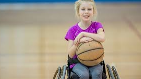

Today I learned a word called " Celebral Palsy" 

Celebral palsy is a condition that gives stiff bones, weak muscles and tremors.

There may be problems of hearing, vision, swallowing and speaking

