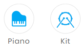

What I have learned

1. I learned how to put a picture on blog

   press windows, shift and s at the same time. Then pull down a rectangle to copy the picture. 

In the typroa u press Ctrl+ V to paste the picture. When asked to copy to, put in ...\images

   

2 .I learned how to write on GitHub 

To write u have to go on the app Typora then choose your work place folder......\posts

.....present my ow E:\github\ ninagu2010.GitHub .io\posts

   3.I learned how to look on someone else's blog

   4.I learned how to change my profile and my respiratory name Go to settings then press rename

5. After save my work in Typora save in posts folder naming with date yyyyy-mm-dd-title

6. Go to GitHub desktop to check and commit our work, push origin maybe u are asked to pull origin once  desktop find new changes in remote repository.

7. Go to web  version GitHub to check your work and edit to see if it is satisfactory then u can see your results in https://ninagu2010.github.io

=======
